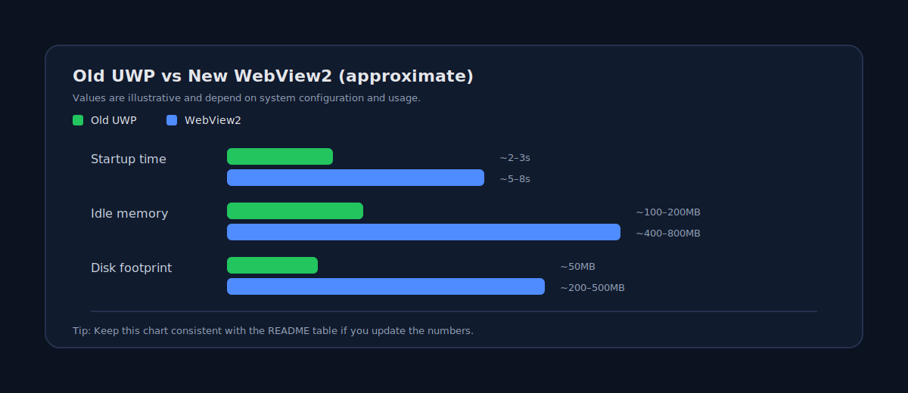

# WhatsApp Desktop UWP - Archive

> **Note**: This repository does not ship official WhatsApp logos/icons. Included visuals are original placeholders for documentation styling.

> **Archive Notice**: This repository serves as documentation and information about the original WhatsApp Desktop UWP application for Windows 10/11. This is an archived version with update protection to prevent forced migration to the WebView2-based version.

## Overview

This is an archive of the **old native WhatsApp Desktop UWP app** that was available before Microsoft's transition to the WebView2-based version. The original app was a true Universal Windows Platform (UWP) application built with modern Windows technologies.

## Why This Archive Exists

After recent WebView2 updates, the current WhatsApp Desktop app has become:
- **Significantly slower** - WebView2 adds overhead compared to native UI
- **Unreliable** - Browser-based wrapper introduces stability issues  
- **Resource-heavy** - Uses excessive disk space and RAM
- **Less integrated** - Doesn't leverage native Windows features as deeply

This archive provides access to the **patched .msix installer** with **update protection** to prevent automatic migration to the WebView2 version.

## Original WhatsApp Desktop UWP Features

The old native UWP app included:

### Native Windows Integration
- **XAML UI Framework** - Smooth, native Windows interface
- **C++/C# Backend** - Efficient, compiled native code
- **Windows API Integration** - Deep OS-level features
- **Action Center Notifications** - Native Windows 10/11 notifications
- **Live Tiles** - Interactive Start menu tiles with message previews
- **Windows Hello** - Biometric authentication support

### Performance Benefits
- ✅ **Faster startup** - Native compiled code vs browser engine
- ✅ **Lower memory usage** - No Chromium overhead
- ✅ **Better battery life** - Optimized for Windows power management
- ✅ **Smaller footprint** - Native binaries vs bundled browser

### Security & Privacy
- 🔒 **End-to-end encryption** - Direct WhatsApp server communication
- 🔒 **Native credential storage** - Windows Credential Manager
- 🔒 **Sandboxed UWP** - Modern Windows app isolation

## Version Comparison

| Feature | Old UWP App | New WebView2 App |
|---------|-------------|------------------|
| **Technology** | Native XAML + C++/C# | Electron-like WebView2 |
| **Startup Time** | Fast (~2-3 sec)* | Slow (~5-8 sec)* |
| **Memory Usage** | ~100-200 MB* | ~400-800 MB* |
| **Disk Space** | ~50 MB* | ~200-500 MB* |
| **Windows Integration** | Deep (Live Tiles, etc.) | Limited |
| **Notifications** | Native Action Center | Web notifications |
| **UI Framework** | Native XAML | Web (HTML/CSS) |
| **Updates** | Controlled | Forced automatic |

_*Values are approximate and may vary based on system configuration, usage patterns, and Windows version. Measurements based on typical usage scenarios._

## Installation

### Prerequisites
- Windows 10 version 1809 or later, or Windows 11
- x64, x86, or ARM64 processor
- Approximately 100 MB free disk space

### Steps
1. Download the patched `.msix` installer from the releases section
2. Enable sideloading if not already enabled:
   - Go to **Settings** > **Update & Security** > **For Developers**
   - Select **Sideload apps** or **Developer mode**
3. Double-click the `.msix` file to install
4. The app will appear in your Start menu as "WhatsApp"

### Update Protection
This patched version includes update protection mechanisms to prevent:
- Automatic updates to WebView2 version
- Forced migration prompts
- Background update downloads

## System Requirements

**Minimum:**
- OS: Windows 10 (1809) or Windows 11
- RAM: 2 GB
- Storage: 100 MB free space
- Internet connection

**Recommended:**
- OS: Windows 10 (21H2) or Windows 11 (22H2)
- RAM: 4 GB or more
- Storage: 500 MB free space (for media cache)

## Known Limitations

- ⚠️ **No official updates** - Security updates from Microsoft Store are blocked
- ⚠️ **Limited support** - Microsoft/WhatsApp no longer support this version
- ⚠️ **Feature freeze** - No new WhatsApp features will be added
- ⚠️ **Compatibility** - May break with future WhatsApp protocol changes

## Legal & Disclaimer

**IMPORTANT NOTICES:**

- This is an **archive for educational and preservation purposes**
- The app remains property of WhatsApp LLC / Meta Platforms, Inc.
- Use at your own risk - no warranty or support provided
- Blocking updates may create security vulnerabilities
- WhatsApp may terminate service for unsupported clients
- We are not affiliated with WhatsApp, Meta, or Microsoft

**By using this archive, you acknowledge:**
- You understand the security implications of using outdated software
- You accept responsibility for any account restrictions
- You comply with WhatsApp's Terms of Service
- This is for personal use only

## Support & Community

Since this is an archived version:
- ❌ No official support from WhatsApp/Microsoft
- ❌ No bug fixes or feature updates
- ✅ Community discussion in Issues tab
- ✅ Documentation improvements welcome

## Contributing

We welcome contributions for:
- 📝 Documentation improvements
- 🐛 Bug reports and workarounds
- 💡 Tips and tricks for optimal usage
- 🔧 Configuration guides

Please open an issue before submitting major changes.

## Frequently Asked Questions

### Why would I want the old version?
If you have an older PC, limited resources, or prefer native Windows apps over web-based wrappers.

### Is this safe to use?
The app itself is the original from Microsoft Store, but blocking updates means no security patches. Use with caution.

### Will my account be banned?
Possibly. WhatsApp may restrict accounts using unsupported clients.

### Can I go back to the new version?
Yes, uninstall this version and download WhatsApp from the Microsoft Store.

### Does this work on Windows 10 Mobile?
This documentation focuses on desktop versions (x64/x86/ARM64).

## Alternative Solutions

If you need a lighter WhatsApp client, consider:
- **WhatsApp Web** - Direct browser access (web.whatsapp.com)
- **Third-party clients** - Various open-source alternatives (use with caution)
- **Progressive Web App** - Install WhatsApp Web as a PWA

## Version History

- **Original UWP App** - Released ~2016, discontinued End of 2025
- **Patched Archive** - (Community-maintained) with update blocks

## License

The WhatsApp application remains property of WhatsApp LLC. This repository provides documentation only.

## Acknowledgments

- WhatsApp team for the original UWP implementation
- Windows UWP platform team at Microsoft
- Community members preserving legacy software

---

**⚠️ This is an unofficial archive. Use responsibly and at your own risk.**
