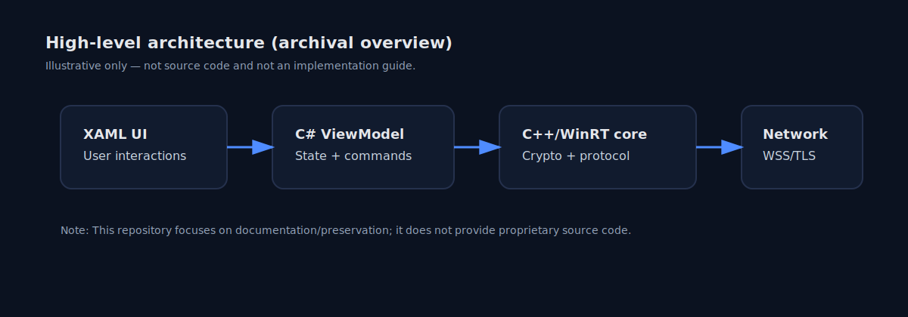

# WhatsApp Desktop UWP

WhatsApp Desktop UWP is a Windows desktop app built for **UWP** with a **WinUI 2** interface and powered by the project's **unofficial Open WhatsApp API** integration layer, not an official WhatsApp API.

## Overview

This repository documents the app, its installation flow, and supporting resources for users who want a native Windows experience. See [DISCLAIMER.md](DISCLAIMER.md) for legal, support, and security considerations, including account-risk notes related to the API usage.

## Warning

This project uses an unofficial API integration. This can affect account safety, service reliability, and long-term support. Read [DISCLAIMER.md](DISCLAIMER.md) before using it.

## Highlights

- Native **WinUI 2** interface
- Built for **Windows 10/11**
- Uses the **Open WhatsApp API** as an unofficial integration
- Lightweight desktop-friendly UI
- Native Windows notifications

## Tech Stack

- **UI:** WinUI 2
- **Platform:** UWP
- **API:** Open WhatsApp API (unofficial)
- **Packaging:** MSIX

## Documentation in This Repository

- `INSTALLATION.md` - setup and install steps
- `TECHNICAL.md` - architecture and implementation notes
- `FAQ.md` - common questions
- `DISCLAIMER.md` - legal and usage notes
- `RESOURCES.md` - useful references

## Installation

See [INSTALLATION.md](INSTALLATION.md) for the current setup instructions.

## Support

If you run into issues, check the [FAQ](FAQ.md) first, then open an issue with details about your environment and the problem.

## License

See [LICENSE](LICENSE) for licensing details.
